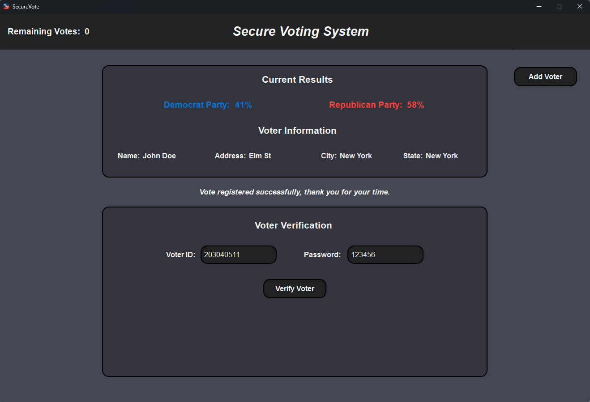
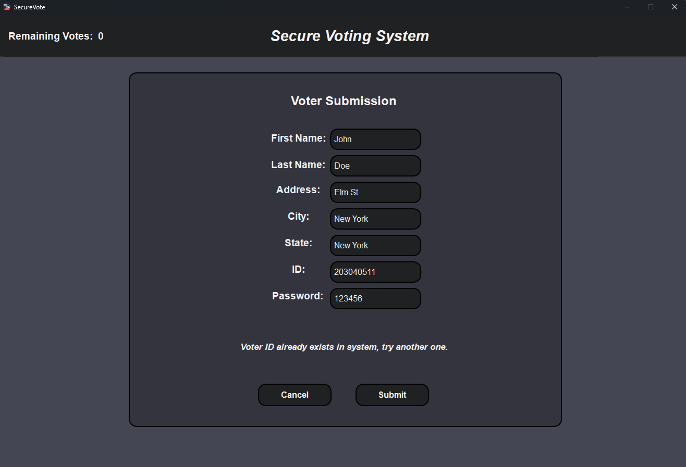

# SecureVote - Secure Voting System

SecureVote is a robust and secure voting system designed to ensure the integrity and privacy of elections. It incorporates advanced cryptographic techniques, including Zero-Knowledge Proof (ZKP) graph isomorphism verification for voter authentication and secure Diffie-Hellman RSA key exchange with digital signatures for processing votes. Voter credentials are securely stored using SHA hashing, ensuring a highly secure environment for managing election processes.

## Features

- **Voter Authentication with ZKP:** Voters are verified using Zero-Knowledge Proof graph isomorphism, ensuring their identity without revealing sensitive information.
- **Secure Communication:** Implements Diffie-Hellman RSA key exchange with digital signatures to ensure votes are securely transmitted to voting centers.
- **Data Security:** Voter information, including ID and passwords, are securely hashed using SHA before being stored in the database.
- **Voter Management:** Add new voters to the system with ease using a simple and intuitive form.
- **Candidate Selection:** Voters can securely cast their votes by selecting their desired candidate after identity verification.
- **PySide Interface:** A user-friendly graphical interface for seamless interaction with the voting system.

## Clone Repository

To get started, clone the repository:

```shell
git clone https://github.com/Shayhha/SecureVote
```

## Database .env Configuration:

Navigate to the config folder, create a new .env file and insert the following:

```shell
DB_HOST="your_database_host"
DB_DATABASE="your_database_name"
DB_PORT="your_database_port"
DB_USER="your_database_username"
DB_PASSWORD="your_database_password"
```

## Usage

1. **Run the Application:**
   ```shell
   python SecureVote.py
   ```
2. **Add Voter:**
   Use the "Add Voter" form to register a new voter in the system.
3. **Verify Voter Identity:**
   On the voter screen, verify the identity of the voter.
4. **Cast Vote:**
   Once verified, select your desired candidate and securely cast your vote.

## Screenshots

### Verify Voter


### Choose Candidate


### Add Voter


## Requirements

Ensure you have the following dependencies installed:

- Python 3.13
- PySide6
- psycopg
- python-dotenv

Install dependencies using pip:

```shell
pip install pyside6
pip install psycopg
pip install python-dotenv
```

## Security Features

1. **Zero-Knowledge Proof (ZKP):** Provides secure and private voter identity verification without revealing sensitive information.
2. **Diffie-Hellman RSA Key Exchange:** Ensures secure communication channels between the system and voting centers.
3. **Digital Signatures:** Protects the integrity and authenticity of votes during transmission.
4. **SHA Hashing:** Safely stores voter credentials (ID and passwords) in the database, preventing unauthorized access.

## Contact

For questions or feedback, please contact [shayhha@gmail.com](mailto:shayhha@gmail.com).

## License

SecureVote is released under the [MIT License](LICENSE.txt).

© All rights reserved to Shayhha (Shay Hahiashvili).
